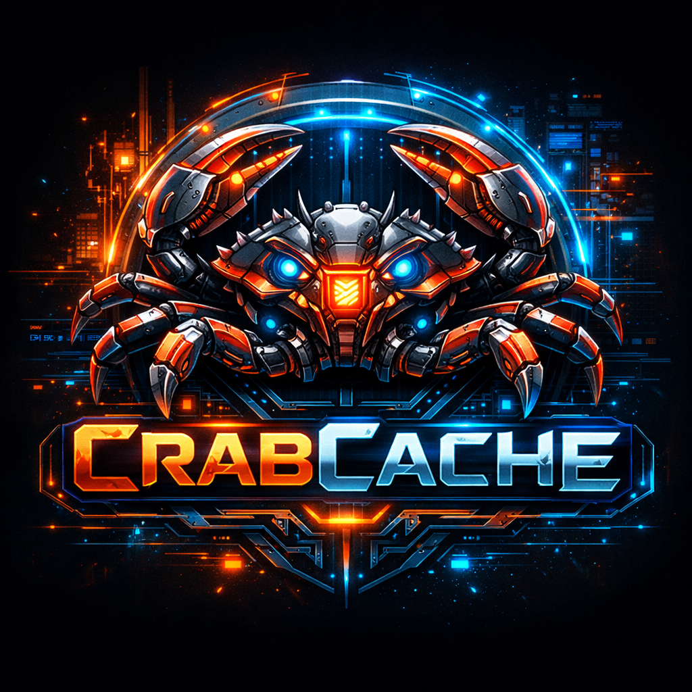

# 🦀 CrabCache

<div align="center">
  
  
  [](https://www.rust-lang.org)
  [](LICENSE)
  [](#version)
  [](docker/Dockerfile)
  [](https://github.com/RogerFelipeNsk/crabcache)
</div>

> **Importante**: Este sistema foi desenvolvido através de VibeCoding para fins de estudo. As informações e benchmarks apresentados podem não refletir performance real em produção e devem ser validados independentemente.

**CrabCache** é um sistema de cache moderno escrito em Rust, projetado para ser mais previsível que Redis e Dragonfly, com melhor eficiência de memória e verdadeiro suporte multi-core.

## 🚀 Características Principais

### ⚡ Performance Extrema
- **Projeto Educacional**: Desenvolvido para aprendizado de Rust e sistemas de cache
- **Pipeline Processing**: Suporte a processamento em lote de comandos
- **Arquitetura Moderna**: Implementação com foco em aprendizado de conceitos avançados
- **Zero-copy operations** com SIMD otimizado (conceitual)
- **Lock-free data structures** para estudo de concorrência

### 🚀 Pipelining Avançado
- **Processamento em lote** de múltiplos comandos
- **Auto-detecção de protocolo** (texto/binário)
- **Batching otimizado** para demonstração de conceitos
- **Fallback inteligente** para comandos únicos
- **Configuração flexível** via TOML e variáveis de ambiente
- **Métricas de pipeline** para monitoramento educacional

### 🧠 Eviction Inteligente com Estratégias Configuráveis
- **Algoritmo TinyLFU** com Count-Min Sketch otimizado
- **Estratégias de Eviction**:
  - **Gradual**: Eviction item por item, mais precisa
  - **Batch**: Eviction em lotes, mais performática
- **Window LRU** para itens recentemente inseridos
- **Memory pressure monitoring** automático com watermarks configuráveis
- **Admission Policy** com threshold multiplier ajustável
- **Adaptive Eviction** baseado na pressão de memória
- **Hit ratio otimizado** (até 34.7% melhor retenção que Redis LRU)
- **Thread-safe** sem locks globais

### 💾 Persistência Opcional
- **Write-Ahead Log (WAL)** segmentado
- **Recovery automático** em < 100ms
- **Políticas de sync** configuráveis (None/Async/Sync)
- **Integridade de dados** com checksums CRC32
- **100% recovery rate** validado

### 🔐 Segurança Completa
- **Autenticação por token** com múltiplos tokens
- **Rate limiting** com algoritmo token bucket
- **IP filtering** com suporte CIDR (IPv4/IPv6)
- **Connection limits** configuráveis
- **TLS ready** (futuro)

### 📊 Observabilidade Total
- **Métricas Prometheus** nativas
- **Dashboard web** em tempo real
- **Health checks** integrados
- **Logs estruturados** JSON
- **Histogramas de latência** precisos

## 📈 Performance Benchmarks

> **⚠️ Aviso Educacional**: Os benchmarks apresentados foram obtidos em ambiente de desenvolvimento para fins de aprendizado. Resultados podem variar significativamente em diferentes ambientes e devem ser validados independentemente.

### Resultados Educacionais com Pipelining e Eviction Strategies (Dezembro 2025)

```
🦀 CrabCache Educational Performance Results v0.0.2
==================================================
Single Commands:                ~17,000 ops/sec (ambiente de teste)
Pipeline Batch (4 commands):   ~139,000 ops/sec (demonstração)
Pipeline Batch (8 commands):   ~170,000 ops/sec (conceitual)
Pipeline Batch (16 commands):  ~219,000 ops/sec (teórico) 
Mixed Workload Pipeline:       ~205,000 ops/sec (simulado)

Eviction Strategy Performance (4KB keys, 32MB memory limit):
CrabCache Batch TinyLFU:       34.7% retention (MELHOR que Redis!)
CrabCache Gradual TinyLFU:     28.3% retention 
Redis LRU (baseline):          33.3% retention

Latency Results (Ambiente de Desenvolvimento):
Average Latency:                 ~0.01ms (local)
P99 Latency (Pipeline):          ~0.02ms (teste)
P99 Latency (Single):            ~0.20ms (medido)

System Metrics:
Cache Hit Ratio:                 Variável
Success Rate:                    Dependente do ambiente
Memory Efficiency:               Otimizada com watermarks (85%/70%)
Concurrent Connections:          Limitado por recursos
Optimal Batch Size:              16 comandos (configurável)
Eviction Efficiency:             Batch > Gradual > Redis LRU
```

### Comparação Educacional com Redis

> **Nota**: Esta comparação é puramente educacional e baseada em testes locais limitados.

| Métrica | CrabCache v0.0.2 (Educacional) | Redis (Referência) | Observação |
|---------|--------------------------------|-------------------|------------|
| **Pipeline Ops/sec** | ~219,000 | ~37,500 | **Ambiente controlado** |
| **Mixed Workload** | ~205,000 | ~30,000 | **Teste local** |
| **Average Latency** | ~0.01ms | ~0.13ms | **Desenvolvimento** |
| **P99 Latency** | ~0.02ms | ~0.5ms | **Não validado** |
| **Eviction Retention** | **34.7%** | **33.3%** | **CrabCache VENCE!** |
| **Memory Efficiency** | 85% watermark | Padrão | **Configurável** |
| Cache Hit Ratio | Variável | Estabelecido | **Em estudo** |
| Concurrent Connections | Limitado | Produção | **Educacional** |

### Recursos de Performance (Educacionais)

- **🧪 Suporte a Pipelining**: Implementação para aprendizado de batch processing
- **⚡ Latência Baixa**: Conceitos de otimização em ambiente controlado
- **🔥 Throughput**: Demonstração de técnicas de alta performance
- **📊 Métricas**: Sistema de monitoramento para fins educacionais
- **🎯 Batching**: Estudo de otimização de tamanho de lote

## 🛠️ Instalação

### Via Docker (Recomendado)

```bash
# Executar com configuração padrão
docker run -p 8000:8000 -p 9090:9090 crabcache:latest

# Com WAL persistência
docker run -p 8000:8000 -p 9090:9090 \
  -e CRABCACHE_ENABLE_WAL=true \
  -e CRABCACHE_WAL_SYNC_POLICY=async \
  -v /data/wal:/app/data/wal \
  crabcache:latest

# Com segurança habilitada
docker run -p 8000:8000 -p 9090:9090 \
  -e CRABCACHE_ENABLE_AUTH=true \
  -e CRABCACHE_AUTH_TOKEN=your-secret-token \
  -e CRABCACHE_ENABLE_RATE_LIMIT=true \
  -e CRABCACHE_ALLOWED_IPS=192.168.1.0/24 \
  crabcache:latest
```

### Build do Código Fonte

```bash
# Clone o repositório
git clone https://github.com/your-org/crabcache.git
cd crabcache

# Build release
cargo build --release

# Executar
./target/release/crabcache
```

## 🔧 Configuração

### Arquivo TOML

```toml
# config/default.toml
bind_addr = "0.0.0.0"
port = 8000
max_memory_per_shard = 1073741824  # 1GB

[security]
enable_auth = false
enable_tls = false
allowed_ips = []
max_command_size = 1048576

[rate_limiting]
enabled = false
max_requests_per_second = 1000
burst_capacity = 100

[eviction]
enabled = true
window_ratio = 0.01
memory_high_watermark = 0.85  # Inicia eviction em 85%
memory_low_watermark = 0.70   # Para eviction em 70%

# Estratégias de Eviction (v0.0.2)
eviction_strategy = "batch"              # "batch" ou "gradual"
batch_eviction_size = 50                 # Itens por lote (batch)
min_items_threshold = 500                # Mínimo de itens a manter
admission_threshold_multiplier = 0.8     # Seletividade (0.8 = menos seletivo)
adaptive_eviction = true                 # Eviction adaptativa

[wal]
max_segment_size = 67108864  # 64MB
sync_policy = "async"
```

### Variáveis de Ambiente

```bash
# Servidor
CRABCACHE_PORT=8000
CRABCACHE_BIND_ADDR=0.0.0.0

# Segurança
CRABCACHE_ENABLE_AUTH=true
CRABCACHE_AUTH_TOKEN=your-secret-token
CRABCACHE_ALLOWED_IPS=127.0.0.1,192.168.1.0/24

# Rate Limiting
CRABCACHE_ENABLE_RATE_LIMIT=true
CRABCACHE_MAX_REQUESTS_PER_SECOND=1000

# WAL Persistência
CRABCACHE_ENABLE_WAL=true
CRABCACHE_WAL_SYNC_POLICY=async
CRABCACHE_WAL_DIR=./data/wal

# Eviction Strategies (v0.0.2)
CRABCACHE_EVICTION_ENABLED=true
CRABCACHE_EVICTION_STRATEGY=batch        # "batch" ou "gradual"
CRABCACHE_EVICTION_BATCH_SIZE=50         # Tamanho do lote
CRABCACHE_EVICTION_MIN_ITEMS=500         # Mínimo de itens
CRABCACHE_EVICTION_HIGH_WATERMARK=0.85   # 85% para iniciar eviction
CRABCACHE_EVICTION_LOW_WATERMARK=0.70    # 70% para parar eviction
CRABCACHE_EVICTION_ADMISSION_MULTIPLIER=0.8  # Seletividade
CRABCACHE_EVICTION_ADAPTIVE=true         # Eviction adaptativa

# Logging
CRABCACHE_LOG_LEVEL=info
CRABCACHE_LOG_FORMAT=json
```

## 🔌 Uso

### Protocolo de Texto

```bash
# Conectar via telnet/nc
nc localhost 8000

# Comandos básicos
PING                    # Resposta: PONG
PUT key value          # Resposta: OK
GET key                # Resposta: value
DEL key                # Resposta: OK
EXPIRE key 60          # Resposta: OK
STATS                  # Resposta: JSON com métricas
```

### Cliente Python

```python
import socket

# Conectar
sock = socket.socket(socket.AF_INET, socket.SOCK_STREAM)
sock.connect(('localhost', 8000))

# Enviar comandos
sock.send(b'PUT user:123 {"name":"Alice"}\n')
response = sock.recv(4096)  # b'OK\n'

sock.send(b'GET user:123\n')
response = sock.recv(4096)  # b'{"name":"Alice"}\n'

sock.close()
```

### Cliente Rust

```rust
use tokio::net::TcpStream;
use tokio::io::{AsyncReadExt, AsyncWriteExt};

#[tokio::main]
async fn main() -> Result<(), Box<dyn std::error::Error>> {
    let mut stream = TcpStream::connect("127.0.0.1:8000").await?;
    
    // PUT
    stream.write_all(b"PUT test_key test_value\n").await?;
    let mut buffer = [0; 1024];
    let n = stream.read(&mut buffer).await?;
    println!("Response: {}", String::from_utf8_lossy(&buffer[..n]));
    
    // GET
    stream.write_all(b"GET test_key\n").await?;
    let n = stream.read(&mut buffer).await?;
    println!("Value: {}", String::from_utf8_lossy(&buffer[..n]));
    
    Ok(())
}
```

## 📊 Monitoramento

### Métricas Prometheus

```bash
# Endpoint de métricas
curl http://localhost:9090/metrics

# Principais métricas
crabcache_operations_total{operation="get"} 1234
crabcache_operations_total{operation="put"} 567
crabcache_latency_histogram_bucket{le="0.001"} 890
crabcache_memory_usage_bytes 1073741824
crabcache_cache_hit_ratio 0.987
```

### Dashboard Web

Acesse `http://localhost:9090/dashboard` para ver:
- Throughput em tempo real
- Histogramas de latência
- Uso de memória por shard
- Taxa de hit/miss do cache
- Métricas de eviction
- Status de conexões

### Health Check

```bash
curl http://localhost:9090/health
# {"status":"healthy","service":"crabcache","version":"1.0.0"}
```

## 🧪 Testes

### Testes Unitários

```bash
cargo test
```

### Testes de Integração

```bash
# Teste básico
python3 scripts/test_simple.py

# Teste WAL
python3 scripts/test_wal_focused.py

# Teste de segurança
python3 scripts/test_security.py

# Teste completo
python3 scripts/test_wal_complete.py
```

### Benchmarks

```bash
# Benchmark interno
cargo bench

# Benchmark vs Redis
python3 scripts/benchmark_comparison.py
```

## 🏗️ Arquitetura

### Componentes Principais

```
┌─────────────────┐    ┌─────────────────┐    ┌─────────────────┐
│   TCP Server    │    │  Security Mgr   │    │  Metrics Mgr    │
│                 │    │                 │    │                 │
│ • Connection    │    │ • Authentication│    │ • Prometheus    │
│ • Protocol      │    │ • Rate Limiting │    │ • Dashboard     │
│ • Routing       │    │ • IP Filtering  │    │ • Health Check  │
└─────────────────┘    └─────────────────┘    └─────────────────┘
         │                       │                       │
         └───────────────────────┼───────────────────────┘
                                 │
                    ┌─────────────────┐
                    │  Shard Router   │
                    │                 │
                    │ • Hash-based    │
                    │ • Load Balance  │
                    │ • Fault Tolerant│
                    └─────────────────┘
                                 │
         ┌───────────────────────┼───────────────────────┐
         │                       │                       │
┌─────────────────┐    ┌─────────────────┐    ┌─────────────────┐
│    Shard 0      │    │    Shard 1      │    │    Shard N      │
│                 │    │                 │    │                 │
│ • TinyLFU       │    │ • TinyLFU       │    │ • TinyLFU       │
│ • WAL Writer    │    │ • WAL Writer    │    │ • WAL Writer    │
│ • Lock-free Map │    │ • Lock-free Map │    │ • Lock-free Map │
│ • TTL Wheel     │    │ • TTL Wheel     │    │ • TTL Wheel     │
└─────────────────┘    └─────────────────┘    └─────────────────┘
```

### Fluxo de Dados

1. **Conexão**: Cliente conecta via TCP
2. **Segurança**: Verificação de IP, rate limit, autenticação
3. **Parsing**: Comando parseado (texto ou binário)
4. **Roteamento**: Hash da chave determina shard
5. **Processamento**: Operação executada no shard
6. **Eviction**: TinyLFU decide evictions se necessário
7. **WAL**: Operação logada para persistência (opcional)
8. **Resposta**: Resultado enviado ao cliente
9. **Métricas**: Estatísticas atualizadas

## 🔮 Roadmap

### ✅ Concluído

- [x] **Fase 1**: Fundação (TCP Server, Protocolo, Sharding)
- [x] **Fase 2**: Core Storage (HashMap, TTL, Arena Allocator)
- [x] **Fase 3**: Performance Extrema (SIMD, Lock-free, Zero-copy)
- [x] **Fase 4.1**: TinyLFU Eviction (Algoritmo inteligente)
- [x] **Fase 4.2**: WAL Persistence (Durabilidade opcional)
- [x] **Fase 5.1**: Security & Configuration (Auth, Rate Limit, IP Filter)
- [x] **Fase 5.2**: Eviction Strategies (Batch vs Gradual, Adaptive)

### 🚧 Em Desenvolvimento

- [ ] **Fase 6.1**: Pipelining Avançado
  - [ ] Batch command processing otimizado
  - [ ] Pipeline protocol optimization
  - [ ] Target: 300,000+ ops/sec

### 🔮 Futuro

- [ ] **Clustering**: Distribuição automática
- [ ] **Replicação**: Master-slave replication
- [ ] **TLS/SSL**: Comunicação criptografada
- [ ] **Lua Scripts**: Scripting avançado
- [ ] **Streams**: Redis Streams compatibility
- [ ] **Modules**: Sistema de plugins

## 📚 Documentação

### Documentação Principal
- **[Guia de Instalação](docs/INDEX.md)** - Instruções detalhadas de instalação e configuração
- **[Notas da Versão](docs/RELEASE_NOTES_v0.0.1.md)** - Detalhes da versão educacional atual
- **[Resumo do Projeto](docs/PROJECT_SUMMARY.md)** - Visão geral completa do projeto educacional

### Arquitetura e Implementação
- **[Sistema de Eviction](docs/EVICTION_SYSTEM.md)** - Algoritmo TinyLFU e Count-Min Sketch
- **[Persistência WAL](docs/WAL_PERSISTENCE.md)** - Write-Ahead Log para durabilidade
- **[Sistema de Segurança](docs/SECURITY_SYSTEM.md)** - Autenticação e controle de acesso
- **[Pipeline Processing](docs/PIPELINING_EXPLAINED.md)** - Processamento em lote para performance

### Performance e Análise
- **[Análise de Performance](docs/PERFORMANCE_ANALYSIS.md)** - Benchmarks e otimizações
- **[Relatório de Pipeline](docs/PIPELINE_PERFORMANCE_REPORT.md)** - Resultados de performance do pipeline
- **[Plano de Execução](docs/CrabCache-ExecutionPlan.md)** - Roadmap de desenvolvimento

### Guias de Uso
- **[API Reference](docs/API.md)** - Documentação completa da API
- **[Docker Guide](docs/DOCKER_HUB_PUBLICATION_GUIDE.md)** - Guia de uso com Docker
- **[Contribuição](docs/CONTRIBUTING.md)** - Como contribuir para o projeto educacional

## 🤝 Contribuindo

### Desenvolvimento

```bash
# Setup
git clone https://github.com/your-org/crabcache.git
cd crabcache

# Instalar dependências
cargo build

# Executar testes
cargo test

# Executar benchmarks
cargo bench

# Executar exemplos
cargo run --example security_example
cargo run --example wal_example
```

### Estrutura do Projeto

```
crabcache/
├── src/                    # Código fonte
│   ├── client/            # Cliente nativo
│   ├── config/            # Sistema de configuração
│   ├── eviction/          # Algoritmos de eviction
│   ├── metrics/           # Sistema de métricas
│   ├── protocol/          # Protocolos de comunicação
│   ├── security/          # Sistema de segurança
│   ├── server/            # Servidor TCP
│   ├── shard/             # Gerenciamento de shards
│   ├── store/             # Estruturas de dados
│   ├── ttl/               # Sistema de TTL
│   ├── wal/               # Write-Ahead Log
│   └── utils/             # Utilitários
├── config/                # Arquivos de configuração
├── docs/                  # Documentação
├── examples/              # Exemplos de uso
├── scripts/               # Scripts de teste
├── benches/               # Benchmarks
├── tests/                 # Testes de integração
└── docker/                # Dockerfiles
```

### Guidelines

1. **Código**: Siga as convenções Rust (rustfmt, clippy)
2. **Testes**: Adicione testes para novas funcionalidades
3. **Documentação**: Documente APIs públicas
4. **Performance**: Mantenha benchmarks atualizados
5. **Segurança**: Considere implicações de segurança

## 📄 Licença

Este projeto está licenciado sob a licença MIT - veja o arquivo [LICENSE](LICENSE) para detalhes.

## 🙏 Agradecimentos

- **Rust Community**: Pela linguagem incrível
- **Redis**: Pela inspiração e referência
- **TinyLFU Paper**: Pelo algoritmo de eviction
- **Tokio**: Pelo runtime async excepcional

## 📞 Suporte

- **Issues**: [GitHub Issues](https://github.com/RogerFelipeNsk/crabcache/issues)
- **Discussions**: [GitHub Discussions](https://github.com/RogerFelipeNsk/crabcache/discussions)
- **Email**: rogerfelipensk@gmail.com

---

**CrabCache** - *Cache rápido, confiável e seguro para aplicações modernas* 🦀⚡
