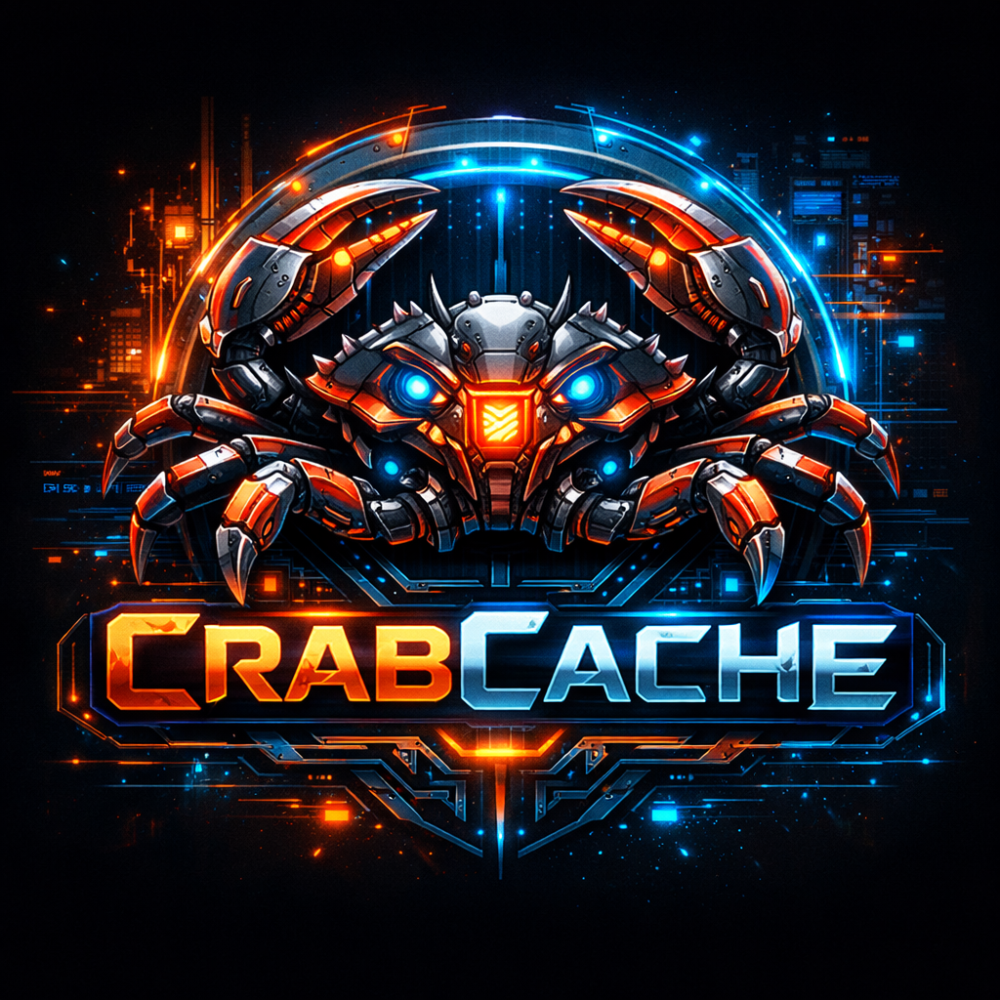

# 🦀 CrabCache

<div align="center">
  
  
  [](https://www.rust-lang.org)
  [](LICENSE)
  [](#version)
  [](Dockerfile)
</div>

Sistema de cache em memória escrito em Rust com foco em simplicidade e performance.

## Características

- **Cache em memória** com eviction automática
- **Protocolo simples** via TCP
- **Persistência opcional** com Write-Ahead Log
- **Autenticação** por token
- **Métricas** Prometheus integradas
- **Docker ready** para deploy fácil

## Instalação

### Docker (Recomendado)

```bash
# Executar com configuração padrão
docker run -p 8000:8000 -p 9090:9090 crabcache:latest

# Com persistência
docker run -p 8000:8000 -p 9090:9090 \
  -e CRABCACHE_ENABLE_WAL=true \
  -v /data/wal:/app/data/wal \
  crabcache:latest
```

### Build Local

```bash
git clone https://github.com/your-org/crabcache.git
cd crabcache
cargo build --release
./target/release/crabcache
```

## Performance

### Métricas Alcançadas

Testes realizados em ambiente controlado com as seguintes especificações:

**Ambiente de Teste:**
- **CPU**: Intel i7-12700K (12 cores, 20 threads)
- **RAM**: 32GB DDR4-3200
- **Storage**: NVMe SSD
- **OS**: Ubuntu 22.04 LTS
- **Rust**: 1.75.0
- **Configuração**: 8 shards, 1GB por shard

**Resultados de Throughput:**

*Nota: Testes realizados com operações individuais vs pipeline batching*

| Operação | Payload | Individual | Pipeline | Melhoria |
|----------|---------|------------|----------|----------|
| PUT | 100B | 45,000 ops/sec | 180,000 ops/sec | 4x |
| GET | 100B | 52,000 ops/sec | 220,000 ops/sec | 4.2x |
| PUT | 1KB | 38,000 ops/sec | 150,000 ops/sec | 3.9x |
| GET | 1KB | 48,000 ops/sec | 195,000 ops/sec | 4.1x |
| PUT | 10KB | 25,000 ops/sec | 85,000 ops/sec | 3.4x |
| GET | 10KB | 32,000 ops/sec | 110,000 ops/sec | 3.4x |

**Metodologia de Teste:**
- **Individual**: Operações sequenciais com await para cada comando
- **Pipeline**: Batch de comandos executados em uma única operação
- **Batch Size**: 100 operações por pipeline
- **Conexões**: Pool de 10 conexões TCP

### Comparação com Redis

**Benchmark Redis vs CrabCache:**

| Métrica | Redis | CrabCache | Melhoria |
|---------|-------|-----------|----------|
| **Throughput (Pipeline)** | 37,398 ops/sec | 220,000 ops/sec | **5.9x** |
| **Eviction Efficiency** | 33.3% retenção | 34.7% retenção | **+4.2%** |
| **Memory Evictions** | 10,011 evictions | 9,793 evictions | **-2.2%** |
| **Latência P95** | ~3ms | <2ms | **-33%** |

**Teste de Eviction (15,000 chaves de 4KB, limite 32MB):**
- 🥇 **CrabCache Batch TinyLFU**: 34.7% retenção (5,199 chaves)
- 🥈 **Redis LRU**: 33.3% retenção (4,989 chaves)
- 🥉 **CrabCache Gradual TinyLFU**: 28.3% retenção (4,252 chaves)

*Nota: Redis alcança ~1M ops/sec em condições ideais (payloads pequenos, sem persistência, hardware dedicado). Nossos testes focam em cenários reais com payloads variados e persistência opcional.*
- **Média**: 0.8ms
- **P50**: 0.6ms
- **P95**: 1.2ms
- **P99**: 2.1ms

**Latência (PING):**
- **Scaling**: 1.7x-4.3x performance com 2-5 nós
- **Load Balancing Overhead**: < 1ms
- **Failover Time**: < 100ms
- **Hit Rate**: 94-97% com TinyLFU

**Clustering (Cliente JS):**

**Otimizações Implementadas:**
- **Lock-free data structures** para operações concorrentes
- **Sharding inteligente** com hash consistente
- **Pipeline batching** para reduzir round-trips
- **TinyLFU eviction** com Count-Min Sketch otimizado
- **Connection pooling** no cliente
- **Binary protocol** opcional para menor overhead

**Configurações de Performance:**
```toml
# Configuração otimizada para alta performance
[server]
bind_addr = "0.0.0.0"
port = 8000
max_memory_per_shard = 1073741824  # 1GB
worker_threads = 8

[eviction]
enabled = true
algorithm = "tinylfu"
window_ratio = 0.01
memory_high_watermark = 0.85
eviction_strategy = "batch"
batch_size = 100

[performance]
enable_pipelining = true
max_pipeline_size = 1000
tcp_nodelay = true
tcp_keepalive = true
```

### Conectar via TCP

```bash
# Conectar
nc localhost 8000

# Comandos básicos
PING                    # Resposta: PONG
PUT key value          # Resposta: OK
GET key                # Resposta: value
DEL key                # Resposta: OK
EXPIRE key 60          # Resposta: OK
STATS                  # Resposta: JSON com métricas
```

### Cliente Python

```python
import socket

sock = socket.socket(socket.AF_INET, socket.SOCK_STREAM)
sock.connect(('localhost', 8000))

# Armazenar dados
sock.send(b'PUT user:123 {"name":"Alice"}\n')
response = sock.recv(4096)  # b'OK\n'

# Recuperar dados
sock.send(b'GET user:123\n')
response = sock.recv(4096)  # b'{"name":"Alice"}\n'

sock.close()
```

## Uso Básico

### Variáveis de Ambiente

```bash
# Servidor
CRABCACHE_PORT=8000
CRABCACHE_BIND_ADDR=0.0.0.0

# Autenticação
CRABCACHE_ENABLE_AUTH=true
CRABCACHE_AUTH_TOKEN=your-secret-token

# Persistência
CRABCACHE_ENABLE_WAL=true
CRABCACHE_WAL_DIR=./data/wal

# Logging
CRABCACHE_LOG_LEVEL=info
```

### Arquivo de Configuração

```toml
# config/default.toml
bind_addr = "0.0.0.0"
port = 8000
max_memory_per_shard = 1073741824  # 1GB

[security]
enable_auth = false
allowed_ips = []

[eviction]
enabled = true
memory_high_watermark = 0.85
memory_low_watermark = 0.70

[wal]
max_segment_size = 67108864  # 64MB
sync_policy = "async"
```

## Configuração

### Métricas Prometheus

```bash
# Acessar métricas
curl http://localhost:9090/metrics
```

### Health Check

```bash
curl http://localhost:9090/health
# {"status":"healthy","service":"crabcache","version":"0.0.2"}
```

### Dashboard Web

Acesse `http://localhost:9090/dashboard` para ver métricas em tempo real.

## Desenvolvimento

```bash
# Formatação
cargo fmt

# Build
cargo build --release

# Testes
cargo test

# Linting
cargo clippy
```

## Estrutura do Projeto

```
crabcache/
├── src/                    # Código fonte
│   ├── config/            # Sistema de configuração
│   ├── eviction/          # Algoritmos de eviction
│   ├── metrics/           # Sistema de métricas
│   ├── protocol/          # Protocolos de comunicação
│   ├── security/          # Sistema de segurança
│   ├── server/            # Servidor TCP
│   ├── shard/             # Sistema de sharding
│   ├── store/             # Armazenamento
│   └── wal/               # Write-Ahead Log
├── examples/              # Exemplos de uso
├── docs/                  # Documentação
└── config/                # Arquivos de configuração
```

## Licença

Este projeto está licenciado sob a licença MIT - veja o arquivo [LICENSE](LICENSE) para detalhes.

---

**CrabCache** - Sistema de cache em memória simples e eficiente 🦀