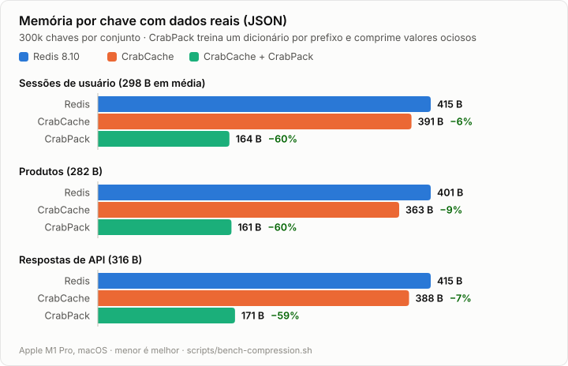

<p align="center"></p>

<h1 align="center">CrabCache</h1>

<p align="center">
  Servidor de cache em memória escrito em Rust, compatível com o protocolo do Redis.<br>
  CrabPack: compressão opcional de valores ociosos com dicionários por prefixo de chave.
</p>

<p align="center">
  <a href="https://github.com/RogerFelipeNsk/crabcache/actions/workflows/ci.yml"></a>
  <a href="https://github.com/RogerFelipeNsk/crabcache/releases"></a>
  <a href="https://hub.docker.com/r/rogerfelipensk/crabcache"></a>
  <a href="LICENSE"></a>
</p>

O CrabCache fala RESP2 e RESP3, então `redis-cli`, `redis-benchmark`, `memtier_benchmark` e as
bibliotecas cliente do Redis funcionam sem nenhuma adaptação.

> **Status:** v0.3. Projeto educacional. Só strings e sem persistência; ainda não é para produção.
> A versão 0.1 está na tag [`legacy-v1`](https://github.com/RogerFelipeNsk/crabcache/tree/legacy-v1);
> veja a errata no [CHANGELOG](CHANGELOG.md) e o guia de [migração](#migrando-da-01).

**Novidade na v0.3.0 — CrabPack:** economize memória em valores semelhantes, como sessões e
respostas de API, com compressão transparente. Na auditoria de JSON sintético, a economia mediana
foi de 55–63% em relação ao Redis. A compressão vem desligada e pode ser ativada por flag,
variável de ambiente ou `CONFIG SET`; veja [como usar](#ativando-o-crabpack).

## Desempenho

Auditoria de 09/10/2026 com CrabCache 0.3.0 e Redis 8.10.2, no Apple M1 Pro/macOS.
Os gráficos mostram a **mediana de três rodadas**, com instâncias novas e o mesmo conjunto de chaves
preenchido antes da medição. Todas as leituras medidas tiveram resultado (zero misses).

<p align="center"></p>

O CrabCache usa `--threads 1` nessa comparação. Isso configura uma thread de I/O; não fixa o processo
a um núcleo. O consumo de CPU de todo o processo também é registrado.

<p align="center"></p>

Resultados por rodada, faixas de variação, configuração padrão, latências e limitações estão em
[docs/BENCHMARKS.md](docs/BENCHMARKS.md). As [saídas brutas](docs/benchmark-results/2026-10-09)
acompanham os resumos; os gráficos são gerados diretamente desses resumos. Cliente e servidor
compartilham esta máquina, então os resultados não demonstram escala em máquinas separadas.

## CrabPack: compressão que aprende com os seus dados

Valores de cache costumam ser pequenos (centenas de bytes) e parecidos entre si: mesmos campos, mesmos
formatos, mesmos enums. O CrabPack usa essa estrutura **em comum** para comprimir valores
individualmente com um dicionário compartilhado:

1. Agrupa as chaves pelo prefixo (`user:`, `session:`, `product:`…) e coleta amostras em background.
2. Treina um dicionário zstd por prefixo e só o mantém se ele comprimir amostras separadas em pelo
   menos 1,25× (redução de 20% no tamanho).
3. Comprime os valores que ficaram ociosos (`--compression-min-idle`, 60 s por padrão). Chaves acessadas
   com frequência continuam sem compressão, e qualquer escrita grava o valor sem compressão de novo.
4. Descomprime de forma transparente: o `GET` devolve exatamente os bytes gravados, e nenhum cliente
   muda nada.

<p align="center"></p>

### Ativando o CrabPack

No servidor local, ative a compressão mantendo o padrão de 60 s sem acesso:

```bash
target/release/crabcache --compression
```

Na imagem da v0.3.0, use a variável de ambiente:

```bash
docker run -d --name crabcache-pack -p 127.0.0.1:6379:6379 \
  -e CRABCACHE_REQUIREPASS=troque-esta-senha \
  -e CRABCACHE_COMPRESSION=true \
  rogerfelipensk/crabcache:v0.3.0
```

Em um servidor local já em execução, configure e acompanhe pelo protocolo Redis
(se houver senha, use `REDISCLI_AUTH`):

```bash
redis-cli CONFIG SET compression yes
redis-cli CONFIG SET compression-min-idle 60
redis-cli CONFIG SET compression-min-size 64
redis-cli CONFIG GET 'compression*'
redis-cli info compression
# Exemplo de saída; os valores dependem do conjunto de dados.
# compression_dicts:1
# compressed_keys:300000
# compression_ratio:3.61
# dict0:prefix=session:,trained_ratio=3.61
```

A compressão é automática e gradual. O treino precisa acumular amostras de valores do mesmo
prefixo (até 1.000 amostras ou 256 KiB), e só é aceito se atingir o ganho mínimo. Valores menores
que 64 B não são candidatos por padrão. Uma ou duas chaves pequenas não demonstram o benefício;
`compressed_keys:0` logo após ativar não indica, por si só, uma falha.

Para desligar a compactação de novos valores, execute `redis-cli CONFIG SET compression no`.
Os valores já comprimidos continuam legíveis. `CONFIG SET` vale para o processo atual; para manter
a opção ao reiniciar, configure a flag ou as variáveis de ambiente no serviço/container.

### Demonstração local

Em uma instância local descartável, use o conjunto sintético incluído no projeto. Primeiro inicie
o servidor em outro terminal:

```bash
cargo build --release --bin crabcache --example dataset
target/release/crabcache --port 7379 --compression --compression-min-idle 0
```

Então carregue as sessões e acompanhe a compactação durante alguns segundos:

```bash
target/release/examples/dataset session 3000 | redis-cli -p 7379 --pipe
redis-cli -p 7379 INFO compression
redis-cli -p 7379 GET session:42
```

O GET retorna o JSON original. `--compression-min-idle 0` serve para esta demonstração imediata;
o padrão de 60 s concentra a compactação em valores frios. O comando GET de clientes existentes
continua igual, sem habilitar um protocolo especial.

**Custos e limites:**

* Descomprimir custa CPU. A tabela de GET em [BENCHMARKS.md](docs/BENCHMARKS.md) compara leituras
  com e sem compressão, conferindo também todos os valores retornados fora do intervalo medido.
* A compactação inicial usa memória temporária. As amostras depois da carga não capturam
  necessariamente o pico; não devem ser usadas como limite máximo de memória.
* Os conjuntos de JSON são **sintéticos e determinísticos**, não dados coletados de produção.
* Dados que não atingem o ganho mínimo podem ter o dicionário rejeitado; valores pequenos ou que
  não economizam espaço são mantidos sem compressão.

Por isso a compressão ainda é opcional nesta versão. Detalhes em [docs/ARCHITECTURE.md](docs/ARCHITECTURE.md#compressão-crabpack)
e números completos em [docs/BENCHMARKS.md](docs/BENCHMARKS.md#crabpack-json-sintético).

## Início rápido

**Docker** (imagem multi-arquitetura para amd64 e arm64):

```bash
docker run -d --name crabcache -p 6379:6379 \
  -e CRABCACHE_REQUIREPASS=troque-esta-senha \
  rogerfelipensk/crabcache:latest

redis-cli -a troque-esta-senha ping
```

A imagem é distroless (sem shell), roda como usuário não-root e tem ~36 MB. Dentro do container o
servidor escuta em `0.0.0.0`, por isso defina sempre `CRABCACHE_REQUIREPASS` se a porta puder ser
acessada de fora.

**A partir do código** (Rust 1.85+):

```bash
cargo build --release
target/release/crabcache              # escuta em 127.0.0.1:6379
redis-cli set saudacao "olá mundo"
redis-cli get saudacao
```

## Usando com seu cliente Redis

Qualquer cliente Redis funciona; os abaixo foram testados contra o CrabCache 0.2.1.

**Node.js** (`redis` 4.x):

```js
import { createClient } from "redis";

const client = await createClient({ url: "redis://localhost:6379" }).connect();
await client.set("sessao:42", "dados", { EX: 3600 });
console.log(await client.get("sessao:42"));
```

**Python** (`redis` 8.x, que negocia RESP3 automaticamente):

```python
import redis

r = redis.Redis(host="localhost", port=6379, decode_responses=True)
r.set("sessao:42", "dados", ex=3600)
print(r.get("sessao:42"))
```

**Rust** (`redis` 1.x, usado nos testes de integração):

```rust
let mut con = redis::Client::open("redis://127.0.0.1:6379/")?.get_connection()?;
redis::cmd("SET").arg("sessao:42").arg("dados").arg("EX").arg(3600).query::<()>(&mut con)?;
let v: String = redis::cmd("GET").arg("sessao:42").query(&mut con)?;
```

## Configuração

Toda opção pode vir da linha de comando ou de variável de ambiente (`crabcache --help`).

| Flag | Variável | Padrão | |
|---|---|---|---|
| `--bind` | `CRABCACHE_BIND` | `127.0.0.1` | Use `0.0.0.0` só com `--requirepass` ou firewall |
| `--port` | `CRABCACHE_PORT` | `6379` | |
| `--threads` | `CRABCACHE_THREADS` | nº de CPUs | Threads de I/O |
| `--io-conns-per-thread` | `CRABCACHE_IO_CONNS_PER_THREAD` | `32` | Conexões por thread antes de ativar outra; `0` = usar todas sempre |
| `--shards` | `CRABCACHE_SHARDS` | 64 × threads | |
| `--maxmemory` | `CRABCACHE_MAXMEMORY` | `0` (sem limite) | ex.: `512mb`, `4gb` |
| `--maxmemory-policy` | `CRABCACHE_MAXMEMORY_POLICY` | `noeviction` | `allkeys-lru`, `allkeys-lfu`, `allkeys-random` |
| `--maxmemory-samples` | `CRABCACHE_MAXMEMORY_SAMPLES` | `5` | |
| `--requirepass` | `CRABCACHE_REQUIREPASS` | — | |
| `--maxclients` | `CRABCACHE_MAXCLIENTS` | `10000` | |
| `--proto-max-bulk-len` | `CRABCACHE_PROTO_MAX_BULK_LEN` | `512mb` | |
| `--client-query-buffer-limit` | `CRABCACHE_CLIENT_QUERY_BUFFER_LIMIT` | `1gb` | |
| `--compression` | `CRABCACHE_COMPRESSION` | desligado | Ativa o CrabPack |
| `--compression-min-idle` | `CRABCACHE_COMPRESSION_MIN_IDLE` | `60` | Segundos sem acesso antes de comprimir |
| `--compression-min-size` | `CRABCACHE_COMPRESSION_MIN_SIZE` | `64` | Valores menores nunca são comprimidos |

`maxmemory`, `maxmemory-policy`, `maxmemory-samples`, `compression`, `compression-min-idle` e
`compression-min-size` também podem mudar em tempo de execução com `CONFIG SET`. Para usar como cache com limite de memória:

```bash
crabcache --maxmemory 2gb --maxmemory-policy allkeys-lfu
```

## Comandos suportados

* **Strings:** `GET`, `SET` (`NX`/`XX`/`GET`/`EX`/`PX`/`EXAT`/`PXAT`/`KEEPTTL`), `SETNX`, `SETEX`,
  `PSETEX`, `GETSET`, `GETDEL`, `GETEX`, `MGET`, `MSET`, `MSETNX`, `INCR`, `DECR`, `INCRBY`, `DECRBY`,
  `APPEND`, `STRLEN`, `GETRANGE`/`SUBSTR`
* **Chaves:** `DEL`, `UNLINK`, `EXISTS`, `TOUCH`, `EXPIRE`/`PEXPIRE`/`EXPIREAT`/`PEXPIREAT`
  (`NX`/`XX`/`GT`/`LT`), `TTL`, `PTTL`, `EXPIRETIME`, `PEXPIRETIME`, `PERSIST`, `TYPE`, `KEYS`, `SCAN`,
  `RANDOMKEY`, `RENAME`, `RENAMENX`, `DBSIZE`, `FLUSHDB`, `FLUSHALL`
* **Conexão e servidor:** `PING`, `ECHO`, `SELECT 0`, `QUIT`, `RESET`, `AUTH`, `HELLO 2|3`, `CLIENT`,
  `COMMAND`, `CONFIG GET/SET/RESETSTAT`, `INFO`, `TIME`, `MEMORY USAGE`

Ainda não há listas, hashes, sets, sorted sets, transações (`MULTI`), pub/sub, Lua, persistência nem
replicação.

## Como funciona

* **Thread-per-core:** cada thread de I/O tem seu próprio runtime e seu próprio `epoll`/`kqueue`. Uma
  conexão é lida, executada e respondida na mesma thread, e as respostas de um lote de comandos saem
  numa única escrita.
* **Distribuição adaptativa:** threads são ativadas conforme o número de conexões cresce, porque
  espalhar carga leve por muitas threads custa mais em despertares do que ganha em paralelismo.
* **Armazenamento compacto:** cada chave ocupa uma entrada de 16 bytes, mais uma única alocação com
  chave, valor e TTL (que só existe se a chave expirar). As entradas ficam em blocos fixos, sem a folga
  e as cópias de um vetor que cresce.
* **CrabPack:** dicionários zstd treinados por prefixo de chave comprimem valores ociosos; a entrada
  marca o valor como comprimido e guarda o dicionário e o tamanho original.
* **Parser incremental** com os mesmos limites de protocolo do Redis, para que um cliente lento ou
  malicioso não consuma CPU nem memória sem limite.

Detalhes em [docs/ARCHITECTURE.md](docs/ARCHITECTURE.md).

## Testes

```bash
cargo nextest run      # ou: cargo test
```

* **Testes diferenciais** (`tests/differential.rs`): sequências aleatórias de comandos são enviadas a
  um Redis real e ao CrabCache, em RESP2 e em RESP3, e as respostas precisam ser idênticas **byte a
  byte**, inclusive as mensagens de erro, com tolerância numérica para TTL e ordenação de `KEYS`.
  Na auditoria local, 1,53 milhão de comandos gerados passaram contra Redis 8.10.2 no macOS.
  Valores e TTLs finais também são conferidos. Sem Redis disponível, o teste avisa e pula; com `CRABCACHE_REQUIRE_REDIS=1` (como no CI), ele
  falha.
* **Testes de integração** (`tests/integration.rs`): servidor real sobre TCP com o cliente
  `redis` do Rust, cobrindo valores binários, pipelining, concorrência, expiração, eviction e limites
  de protocolo.
* Testes unitários do parser, do armazenamento, da expiração e da eviction.

O CI roda fmt, clippy com `-D warnings`, todos os testes em Linux e macOS, `cargo audit` e um teste da
imagem Docker. Nenhum passo tolera falha.
O smoke test da imagem também comprime 2.000 valores binários, confere todos os bytes e valida TTL,
leitura com compressão desligada e uma escrita sobre valor previamente comprimido.

Para reproduzir os benchmarks: `scripts/bench.sh`, `scripts/bench-1cpu.sh`,
`scripts/bench-memory.sh` e `scripts/bench-compression.sh` (instruções em [docs/BENCHMARKS.md](docs/BENCHMARKS.md)).

## Migrando da 0.1

A 0.2 é incompatível com a 0.1:

| 0.1 | 0.2 |
|---|---|
| Protocolo de texto próprio (`PUT k v`) e cliente `crabcache-client-js` | Protocolo do Redis: use qualquer cliente Redis (`SET k v`) |
| Porta `8000` | Porta `6379` |
| Métricas HTTP na porta `9090` | `INFO` pelo próprio protocolo |
| `CRABCACHE_BIND_ADDR` | `CRABCACHE_BIND` |
| `CRABCACHE_SERVER_TYPE`, protocolo TOON | Removidos: há um único servidor |
| Escuta em `0.0.0.0` por padrão | Escuta em `127.0.0.1` por padrão |

## Roadmap

1. Tipos de dados: hashes, listas, sets e sorted sets.
2. Persistência (snapshot + log) e `MULTI`/`EXEC`.
3. CrabPack fase 2: retreino de dicionários quando os dados mudam, descompressão mais rápida e um
   formato estruturado para JSON (consultas como `JSON.GET user:1 $.email` sem descomprimir tudo).
4. Armazenamento ainda mais compacto: alocação em slabs por shard e valores pequenos inline.
5. Benchmarks em Linux com cliente e servidor em máquinas separadas, e migração de conexões entre
   threads.

## Licença

MIT. Veja [LICENSE](LICENSE).
