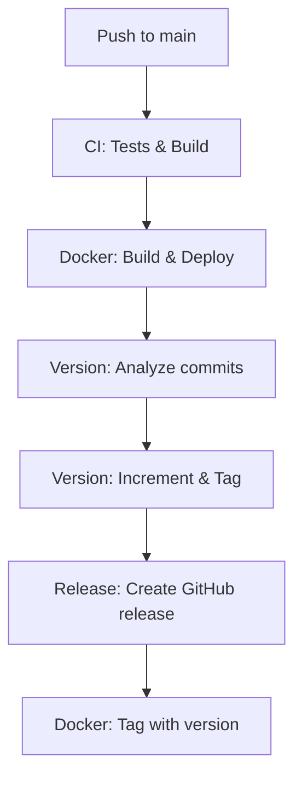

# Setup Completo de Automação - CrabCache

## ✅ O que foi configurado

### 1. Deploy Automático Docker
- **Trigger**: Push para branch `main`
- **Resultado**: Imagem publicada no Docker Hub
- **Tags**: `latest` e `main-{sha}`

### 2. Versionamento Automático
- **Trigger**: Push para `main` (após deploy)
- **Análise**: Conventional commits
- **Resultado**: Nova versão, tag e release

### 3. Scripts e Ferramentas
- **Script de setup**: `scripts/setup-docker-deploy.sh`
- **Script de versão**: `scripts/version.sh`
- **Documentação completa**: `docs/`

## 🔧 Configuração Necessária

### Secrets do GitHub
Configure em: **Settings → Secrets and variables → Actions**

| Secret | Valor | Descrição |
|--------|-------|-----------|
| `DOCKER_USERNAME` | `seu-usuario` | Usuário Docker Hub |
| `DOCKER_PASSWORD` | `seu-token` | Token Docker Hub |

### Como obter Docker Token
1. Acesse [Docker Hub Security](https://hub.docker.com/settings/security)
2. Clique em **New Access Token**
3. Nome: "GitHub Actions Deploy"
4. Permissões: Read, Write, Delete
5. Copie o token gerado

## 🚀 Como usar

### Desenvolvimento Normal
```bash
# Fazer mudanças seguindo conventional commits
git add .
git commit -m "feat: add new cache algorithm"
git push origin main

# Resultado automático:
# 1. Testes executados
# 2. Docker build e deploy
# 3. Versão incrementada (0.0.2 → 0.0.3)
# 4. Tag v0.0.3 criada
# 5. Release no GitHub
# 6. Imagem no Docker Hub
```

### Versionamento Manual
```bash
# Ver status atual
./scripts/version.sh current

# Fazer bump manual
./scripts/version.sh bump minor

# Gerar changelog
./scripts/version.sh changelog
```

### Controle Fino
```bash
# Pular versionamento
git commit -m "docs: update readme [skip-version]"

# Pular CI completo
git commit -m "chore: minor cleanup [skip-ci]"
```

## 📋 Tipos de Commit

| Commit | Incremento | Exemplo |
|--------|------------|---------|
| `feat:` | minor (0.X.0) | `feat: add Redis compatibility` |
| `fix:` | patch (0.0.X) | `fix: resolve memory leak` |
| `perf:` | patch (0.0.X) | `perf: optimize lookup speed` |
| `docs:` | patch (0.0.X) | `docs: update API guide` |
| `feat!:` | major (X.0.0) | `feat!: change API format` |

## 🔄 Fluxo Completo



## 📁 Arquivos Criados/Modificados

### Workflows
- `.github/workflows/ci.yml` - CI com deploy Docker
- `.github/workflows/version.yml` - Versionamento automático
- `.github/workflows/release.yml` - Release com versão

### Scripts
- `scripts/setup-docker-deploy.sh` - Validação setup
- `scripts/version.sh` - Gerenciamento versões

### Documentação
- `docs/DOCKER_DEPLOY_SETUP.md` - Setup Docker
- `docs/VERSIONING_GUIDE.md` - Guia versionamento
- `docs/DEPLOY_AUTOMATION_SUMMARY.md` - Resumo deploy
- `docs/AUTOMATION_COMPLETE_SETUP.md` - Este arquivo

## 🧪 Teste o Sistema

### 1. Validação Local
```bash
./scripts/setup-docker-deploy.sh
```

### 2. Teste Completo
```bash
# Fazer uma mudança de teste
echo "# Test" >> README.md
git add README.md
git commit -m "feat: test automation system"
git push origin main

# Acompanhar em:
# - GitHub Actions (aba Actions)
# - Docker Hub (seu repositório)
# - Releases (aba Releases)
```

## 🎯 Próximos Passos

1. **Configure as secrets** (obrigatório)
2. **Teste com commit de exemplo**
3. **Verifique resultados**:
   - ✅ Actions executaram
   - ✅ Imagem no Docker Hub
   - ✅ Nova versão/tag criada
   - ✅ Release no GitHub

## 🆘 Troubleshooting

### Docker deploy falha
- Verifique secrets `DOCKER_USERNAME` e `DOCKER_PASSWORD`
- Confirme que o repositório Docker Hub existe
- Verifique permissões do token

### Versionamento não funciona
- Confirme formato conventional commits
- Verifique se não há `[skip-version]`
- Confirme permissões do `GITHUB_TOKEN`

### Build falha
- Verifique logs na aba Actions
- Confirme que testes passam localmente
- Verifique sintaxe do `Cargo.toml`

## 🎉 Benefícios

- **Zero configuração manual** após setup inicial
- **Versionamento semântico** automático
- **Deploy contínuo** para Docker Hub
- **Changelog automático** com categorização
- **Rastreabilidade completa** via tags e releases
- **Suporte multi-arquitetura** (Intel + ARM)

---

**Sistema pronto para uso!** Configure as secrets e faça um push para testar. 🚀